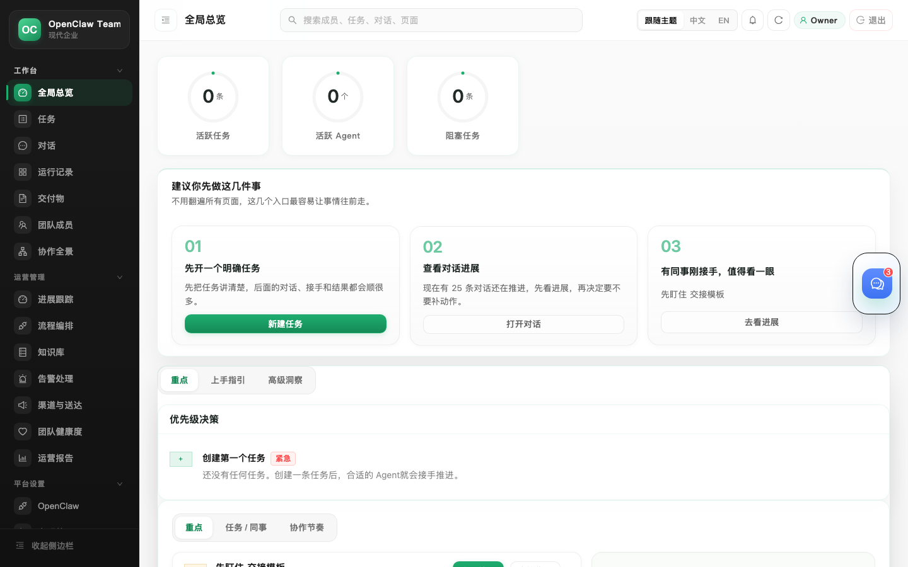
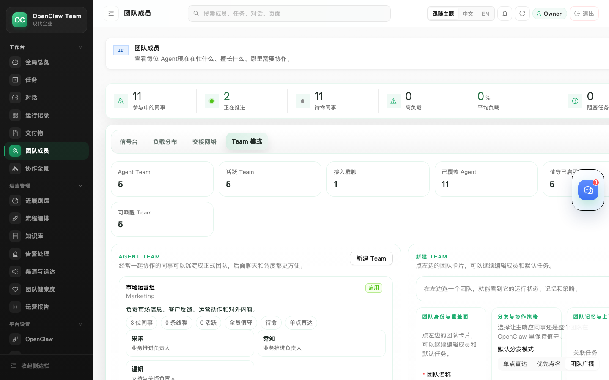
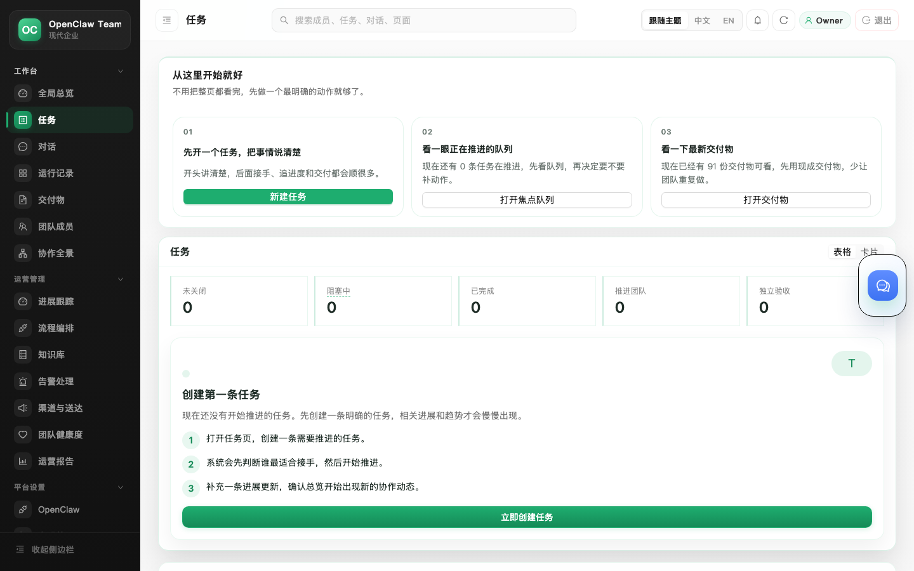
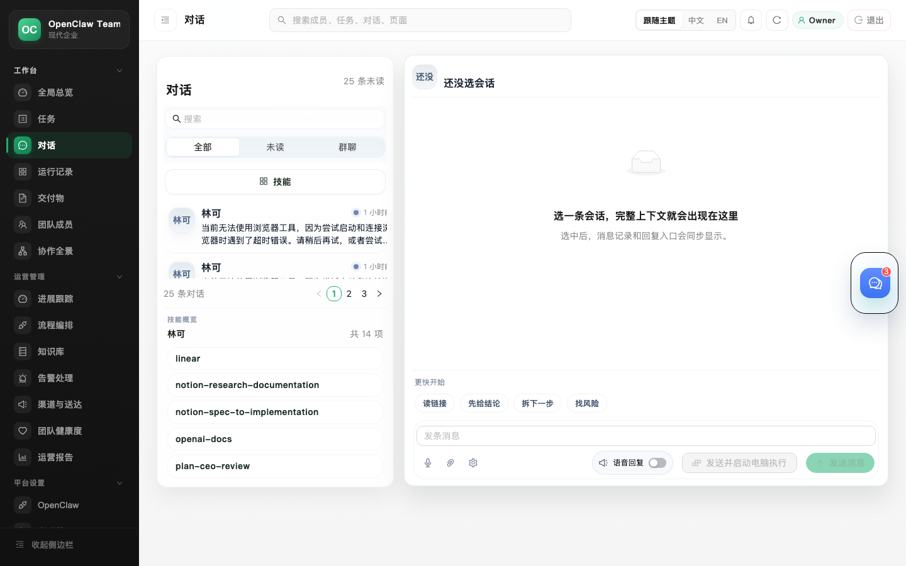
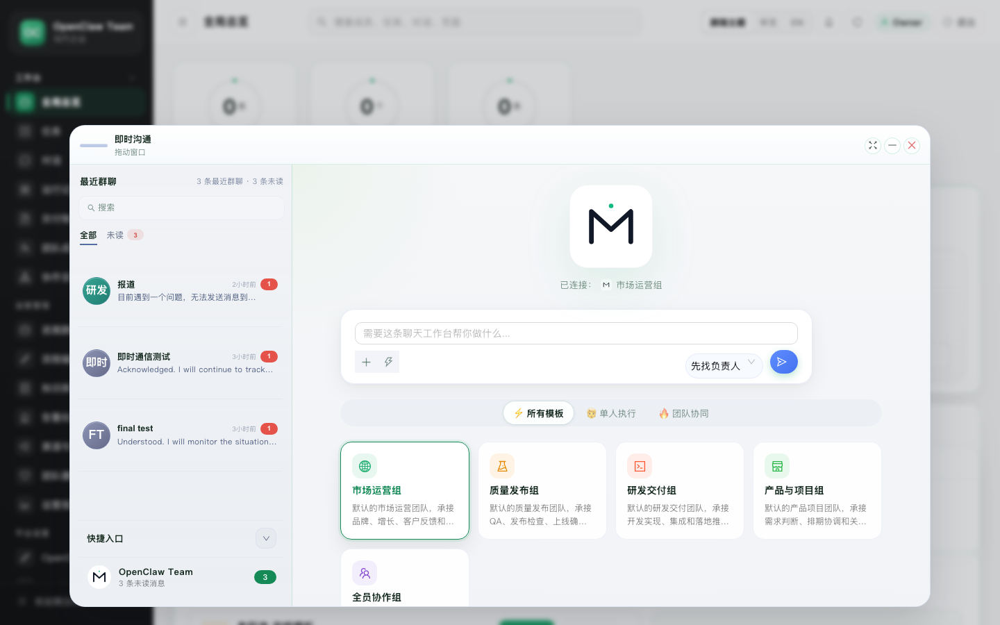
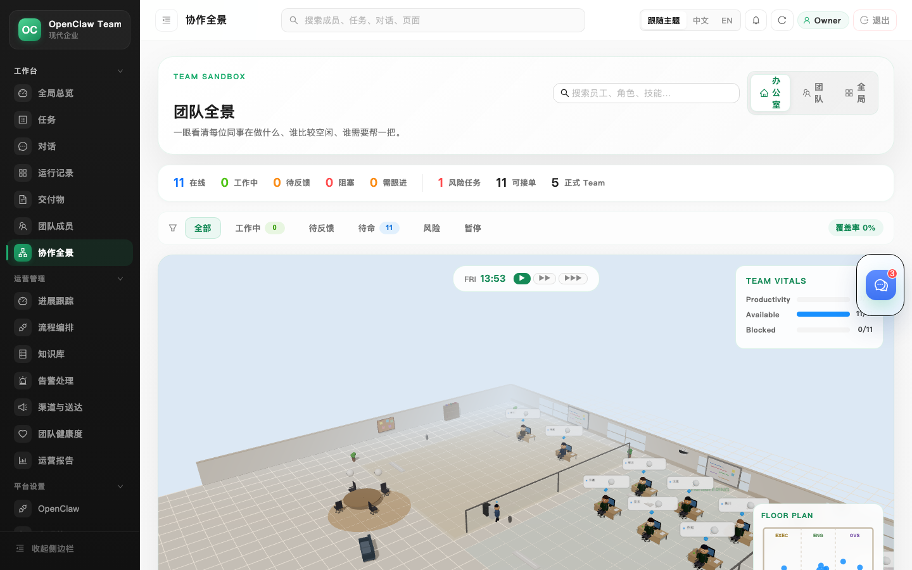
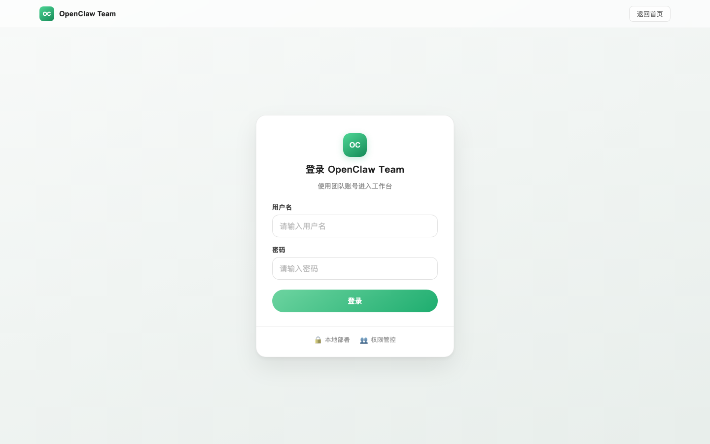

# OpenClaw Team

**Open-source Agent operations and orchestration platform.**

Task dispatch · Workflow orchestration · Runtime monitoring · Outcome delivery

---



## Screenshots

| Overview | Agents | Tasks |
|----------|--------|-------|
|  |  |  |

| Conversations | Floating Chat |
|--------------|---------------|
|  |  |

| 3D Battlefield | Login |
|---------------|-------|
|  |  |

## Features

| Feature | Description |
|---------|-------------|
| **Task Dispatch** | Intelligent routing — tasks auto-match the best agent |
| **Workflow Orchestration** | Visual multi-agent workflow editor with replay |
| **Runtime Monitoring** | Agent health, load, alerts on a unified dashboard |
| **Floating Chat** | Instant messaging with agents — quick threads, mentions, file sharing without leaving the page |
| **3D Office** | Real-time 3D office view — see agent workstations, team vitals, and collaboration status at a glance |
| **Skill Management** | Hot-load skills, version control, 50+ model support |
| **Multi-tenant** | Role-based access, tenant API keys, audit logs |
| **Self-hosted** | All data on your infrastructure, AGPL-3.0 licensed |

## Quick Start

### Docker (recommended)

```bash
git clone https://github.com/imgolye/openclaw-team.git
cd openclaw-team
cp .env.example .env    # configure API keys and passwords
docker compose up -d
```

Open `http://localhost:18890` in your browser.

### Local Install

```bash
git clone https://github.com/imgolye/openclaw-team.git
cd openclaw-team
bash platform/bin/install/setup.sh
bash platform/bin/deploy/start_host_product.sh
```

### Prerequisites

- [OpenClaw](https://getopenclaw.ai) >= 2026.3.12
- Python 3.10+
- PostgreSQL 16+

## Architecture

```
User → Web UI → HTTP API → Application Services → Domain Core
                                ├── Storage (PostgreSQL)
                                ├── OpenClaw Runtime
                                └── LLM Providers (50+)
```

**Modules:**
- **Workspace** — Overview, Tasks, Conversations, Runs, Deliverables, Agents
- **Ops** — Management, Orchestration, Alerts, Agent Health, Reports
- **Platform** — OpenClaw, Themes, Admin, API Keys

## Directory Structure

```
openclaw-team/
├── apps/frontend/    # Pre-built web UI
├── backend/          # Python API server (AGPL-3.0)
├── platform/
│   ├── bin/          # Install, deploy, runtime scripts
│   ├── config/       # Themes, runtime profiles
│   ├── infra/        # Docker, database
│   └── skills/       # Built-in skill packs
├── docs/             # Documentation
├── Dockerfile
└── docker-compose.yml
```

## Documentation

- [System Overview](docs/architecture/system-overview.md)
- [Repo Structure](docs/project/repo-structure.md)
- [Local State Guide](docs/project/local-state.md)
- [Runtime Profiles](docs/runtime/runtime-profiles.md)
- [API Spec](http://localhost:18890/api/v1/docs) (available when server is running)

## License

**AGPL-3.0** — see [LICENSE](./LICENSE) and [NOTICE](./NOTICE).

Commercial licensing available for proprietary use. Contact the maintainers for details.

Frontend is distributed as pre-built static assets. Source code is not included.

## Contributing

See [CONTRIBUTING.md](./CONTRIBUTING.md).
